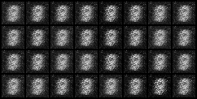
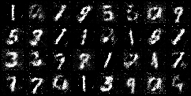

# Proyek Implementasi GAN dengan PyTorch

Proyek ini adalah implementasi dari Generative Adversarial Network (GAN) sederhana untuk menghasilkan gambar tulisan tangan dari dataset MNIST. Proyek ini dibuat sebagai bagian dari tugas mata kuliah Pembelajaran Mesin 2.

[](https://www.python.org/downloads/) [](https://pytorch.org/) 

---
## 📝 Deskripsi

Notebook `gan_kelompokX.ipynb` berisi seluruh proses, mulai dari penjelasan konsep dasar GAN, implementasi model Generator dan Discriminator, hingga proses training dan visualisasi hasil.

- **Generator**: Mengambil input vektor acak berukuran 100 dan menghasilkan gambar 28x28 piksel.
- **Discriminator**: Membedakan antara gambar asli dari dataset MNIST dan gambar palsu dari Generator.

## 📸 Contoh Hasil

Berikut adalah perbandingan hasil dari epoch awal dan akhir.

| Hasil di Epoch 5 | Hasil di Epoch 50 |
| :---: | :---: |
|  |  |

---
## 🚀 Cara Menjalankan

1.  **Kloning repositori ini:**
    ```bash
    git clone [https://www.andarepository.com/](https://www.andarepository.com/)
    cd [Nama Repositori Anda]
    ```

2.  **Instal dependensi yang dibutuhkan:**
    ```bash
    pip install torch torchvision matplotlib numpy
    ```

3.  **Jalankan Jupyter Notebook:**
    Buka dan jalankan file `gan_kelompokX.ipynb`.

---
## 📂 Struktur Direktori

```
/
├── gan_kelompokX.ipynb     
├── generated_images/       
├── models/                 
└── README.md
```

---
## 🧑‍💻 Anggota Kelompok

* Nero Caesar Suprobo
* Muhammad Umar Baihaqi
* Muhammad Mishbahul Muflihin
* Muhammad Haekal 
* Muhammad Akmal Najib Gunawan 
* Mhd Nurdin Al-Kahfi